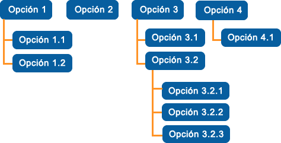

# Menu dinámico laravel

Menú dinámico de enlaces realizado con laravel y bootstrap 3 con el propósito de poder gestionar y administrar
un menu de navegación de un sitio web

# Imagen

# Instalacion
1- clona el repositorio
<b>git clone https://github.com/DennisMartel/menu-enlaces-dinamicos.git</b>

2- instala las dependencias
<b>composer install</b>

3- Genera la key de laravel, ¿Pero como?

Abre el proyecto en tu editor de código favorito

Crea un nuevo archivo .env en la raiz del proyecto

Copia el codigo del archivo .env.example en el archivo .env

Configura las variables de entorno del archivo .env

Ejecuta el comando: <b>php artisan key:generate</b> desde la raiz de tu proyecto
